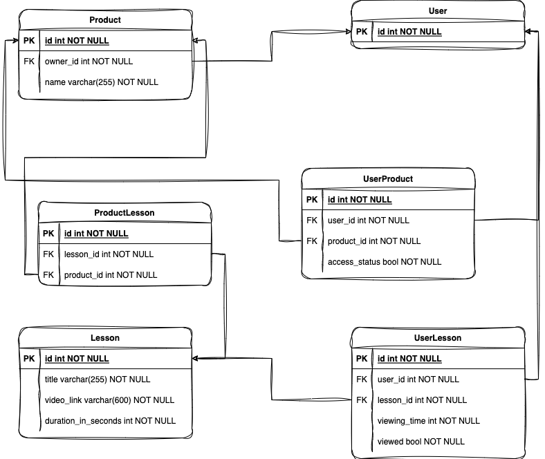

## TO DO:
* Add a swagger
* Unit testing

## ERD


## Quick start

Install poetry
```bash
curl -sSL https://install.python-poetry.org | python3 -
```

Clone the project
```bash
git clone https://github.com/n1ce7ry/education_api
```

Install the dependencies
```bash
poetry shell
poetry install
```

Edit env.example, rename it to env.sh, and run it:
```bash
vim env.example
mv env.example env.sh
. ./env.sh
```

Apply migrations
```bash
./manage.py migrate
```

Run server 
```bash
./manage.py runserver
```


